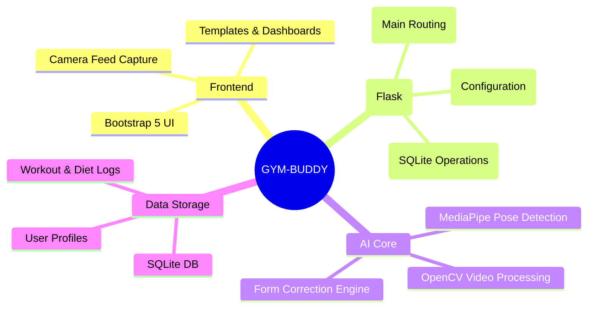

# 🏋️ GYM-BUDDY: AI Gym & Fitness Assistant

**AI Gym & Fitness Assistant** is a full-stack web application providing AI-powered tracking, diet planning, and gym recommendations. It uses advanced pose detection technology to give real-time feedback on your workout form.

---

## 🚀 Features

- **Real-Time Pose Detection**: Utilizes MediaPipe and OpenCV to accurately track and correct your exercise form.
- **Diet Planning**: Personalized nutrition and meal recommendations to support your fitness goals.
- **Gym Recommendations**: Tailored workout routines according to your physical capabilities and goals.
- **Progress Tracking**: Persistent storage for all your routines and diet plans using an SQLite database.
- **User-Friendly Dashboard**: Built with Bootstrap 5 on a robust Flask backend for a responsive experience.

---

## 🧠 Application Architecture (Mind Map)



## 🛠️ Tech Stack

- **Backend**: Python, Flask
- **Frontend**: HTML5, Bootstrap 5, JavaScript
- **AI & Computer Vision**: OpenCV, Google MediaPipe
- **Database**: SQLite

---

## 📂 Project Structure

```text
AI_Gym_Fitness/
│
├── app.py                 # Main Flask Application
├── database.py            # SQLite Database Setup & Models
├── config.py              # Application Configuration
├── start_server.py        # Server Initialization Script
├── requirements.txt       # Python Dependencies
├── modules/               # Core Application Logic & AI processing
├── templates/             # HTML Frontend Templates
├── static/                # CSS, JS, and Image Assets
├── data/                  # Local storage and exported metrics
└── docs/                  # Additional Documentation
```

## 🚦 Getting Started

1. **Clone the repository**
   ```bash
   git clone https://github.com/ganeshboda5495007-byte/GYM-BUDDY.git
   cd GYM-BUDDY
   ```

2. **Install the dependencies**
   Make sure you have Python 3.8+ installed.
   ```bash
   pip install -r requirements.txt
   ```

3. **Initialize the Database** (if necessary)
   ```bash
   python fix_db.py
   ```

4. **Run the Application**
   You can start the server via the batch or python script:
   ```bash
   python start_server.py
   ```
   Or explicitly just running the app:
   ```bash
   python app.py
   ```

5. **Access the Web App**
   Open your browser and navigate to `http://localhost:5000`.

---

## 📜 License

This project is licensed under the MIT License - see the [LICENSE](LICENSE) file for details.
