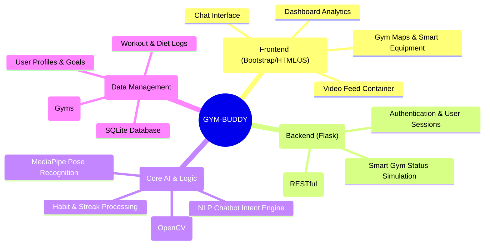

# 🏋️ GYM-BUDDY: Comprehensive AI Fitness & Gym Assistant

**GYM-BUDDY** is an advanced full-stack web ecosystem that serves as your all-in-one virtual fitness assistant. By combining computer vision, AI-driven chat, localized gym searching, and progress-tracking, it creates a personal training environment natively in your browser.

---

## 🧠 Application Architecture (Mind Map)



---

## 🌟 Key Features

### 1. 🤖 AI Personal Trainer (Real-Time Form Detection)
Utilizing your web camera, the application captures video feeds and processes them using **MediaPipe** and **OpenCV**. It counts your repetitions and dynamically checks your posture format for exercises like squats or pushups.

### 2. 🥗 Smart Diet & Nutrition Planner
Generates completely personalized diet and meal plans. Calculates your BMI and caloric needs based on user stats (Height, Weight, Age, Diet Type) to help you consistently hit your fitness targets.

### 3. 💬 AI Chat & Fitness Support
Equipped with a robust intent-recognition fitness chatbot, handling dynamic Q&A about exercises, diets, or application navigation to keep you motivated.

### 4. 📅 Habit & Progress Tracking
Track your fitness consistency daily! Features include **Check-Ins**, **Mood Logging**, **Current Streak Management**, and visual **Performance Reports** over weekly metrics to solidify good habits.

### 5. 📍 Local Gym Finder
A location-based gym directory that allows users to filter gyms by available amenities, pricing, geolocation (latitude/longitude), and radius tracking. 

### 6. 🏋️ Smart Gym Simulator
A dedicated dashboard acting as a smart digital twin to physical gym equipment. Check the real-time status of connected machines, and simulate smart adjustments like treadmill speed directly from the dashboard!

---

## 🗺️ Project Roadmap

- **[x] Phase 1 - Foundation:** Base Flask application, SQLite Database setup, Authentication (Login/Register).
- **[x] Phase 2 - AI Integration:** Implementing OpenCV + MediaPipe for form tracking and rep counting.
- **[x] Phase 3 - Daily Tracking & Nutrition:** Habit check-ins, streaks, graphical reports, and personalized BMI/Diet calculations.
- **[x] Phase 4 - Gym Locator & Smart Equipment:** Building the gym discovery platform and simulating smart equipment adjustments.
- **[ ] Phase 5 - Mobile Optimization:** Migrate core ML models to edge devices / PWA implementation for better mobile responsiveness.
- **[ ] Phase 6 - Social & Leaderboards:** Connect with friends, verify physical challenges, and build a local community leaderboard.
- **[ ] Phase 7 - Wearable Integrations:** Connect directly to Apple Health, Google Fit, and Garmin devices.

---

## 🛠️ Tech Stack

- **Backend**: Python, Flask, Flask-Login, SQLite
- **Frontend**: HTML5, Vanilla JavaScript, Bootstrap 5 UI
- **AI & Computer Vision**: OpenCV, Google MediaPipe Pose
- **Data Serialization**: JSON / RESTful APIs

---

## 📂 Project Structure

```text
/
├── app.py                 # Main Flask Application & Route Handlers
├── database.py            # SQLite DB Initialization & Models
├── config.py              # Global Application Configuration
├── start_server.py        # Main Server Initialization Wrapper
├── fix_db.py              # Script to reset/initialize DB
├── modules/               # Core Application Logic (Auth, CV, Chat)
├── templates/             # Jinja2 HTML Frontend Templates
├── static/                # CSS Stylesheets, JS, and Images
├── data/                  # Exported metrics and storage files
└── docs/                  # Additional Documentation
```

---

## 🚦 Getting Started (Installation & Setup)

1. **Clone the repository**
   ```bash
   git clone https://github.com/ganeshboda5495007-byte/GYM-BUDDY.git
   cd GYM-BUDDY
   ```

2. **Set up Virtual Environment** (Optional but recommended)
   ```bash
   python -m venv venv
   # On Windows:
   venv\Scripts\activate
   # On macOS/Linux:
   source venv/bin/activate
   ```

3. **Install Dependencies**
   Requires Python 3.8+
   ```bash
   pip install -r requirements.txt
   ```

4. **Initialize Database**
   (Creates the base tables and sets up SQLite file)
   ```bash
   python fix_db.py
   ```

5. **Start Application**
   ```bash
   python start_server.py
   # Or alternatively:
   python app.py
   ```

6. **Access the Web Interface**
   Open your browser and navigate to `http://localhost:5000`

---

## 📜 License

This project is licensed under the MIT License - see the [LICENSE](LICENSE) file for complete details.
